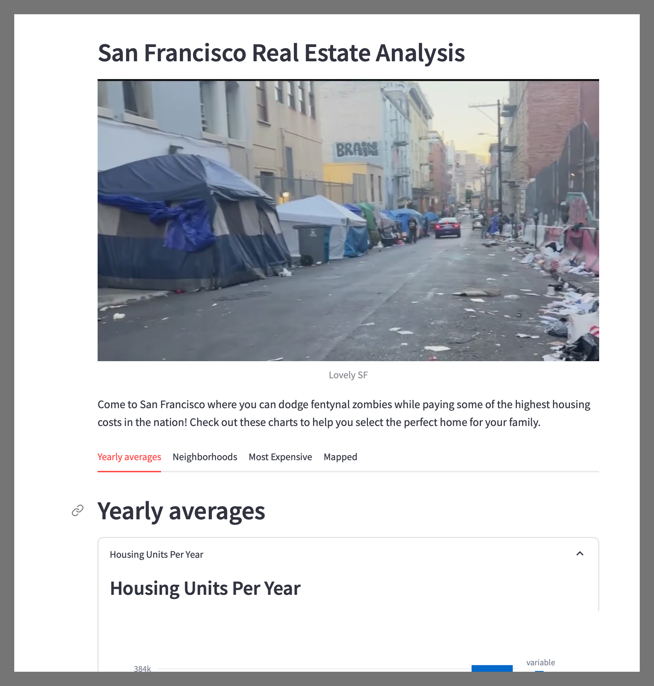

# San Francisco Real Estate Analysis

Hi! Check out my Streamlit app. This is a preview of the wonders in store for anyone lucky enough to have the skills and desire to run this app on their machine:



All you have to do is download or clone this repository to your local machine. You will need to have (Python)[https://www.python.org/downloads/] and (Streamlit)[https://docs.streamlit.io/get-started/installation] installed on your machine as well. If you don't already have them, follow the links and install them. 

Using your command line interface, navigate to this repository and enter the command:

```bash
streamlit run dashboard.py
```

If everything is working properly, a window should open in your default browser with the contents of the streamlit app.

If this doesn't happen, it's possible that you're just not clever enough to see this dashboard. It may just not be _for_ you. 

If it _does_ work for you, you can consider yourself a very clever boy, or, if you happen to be a girl, a very clever girl indeed. 